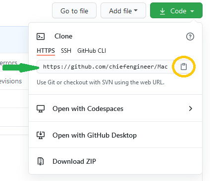

---
{
  "Tags": 
  [
    "Git"
    , "Git-Flow"
    , "Visual Studio Code"
    , "VS Code"
    , "Beyond Compare"
  ]
  , "Date": "2020-12-21"  
  , "Author": "Bruce Lackore, Lead Engineer, Arizona Office of the Courts  "
  , "Software Versions":
    [
      "Git version 2.29.2.3"
      , "Beyond Compare 4.3.7, Build 25118"
    ] 
}
---

### Install, configure and perform basic activities using Git:

 1. Install Git for Windows 10  

 2. Configure Git for Windows 10  

 3. Create aliases for commonly used Git commands  

 4. Optionally configure Git to use Beyond Compare as a Diff/merge tool  

</b>

  
Definitions

Version Control System.
  * Centralized - Essentially a centralized Version Control System (VCS) is  
    defined by it's requirement that all inputs be stored in a central location  
    on a purpose-designated server.  
    All users must communicate with the server to check changes in and obtain  
    the latest changes from their co-workers.

  * Distributed - A distributed VCS works as a community. Each user has  
    (potentially) a full copy of the work in progress and thus all versions  
    of the repository are equal in that if one member leaves the team, there  
    is no specific problem in that everyone else will have a full copy of the  
    repository.

  
Goals

1. Install Git
2. Create Git aliases for commonly used commands
3. Explain the Git file structure from the 50,000 ft level
4. Demonstrate why Git is safe
5. Demonstrate branching and branch merging in Git
6. Show a usable, production-ready process for integrating Git into the  
   development process.

  
Requirements

    1. Administrative access on the host.  
    2. A standardized location on the host to store local copies of repositories  
      a. A suggestion is Users\<Your user name>\Documents\_Repos

  
Presumptions

    1.  Ability to open an administrative command prompt.  
    2.  Ability to open an administrative PowerShell prompt.  
    3.  Ability to cause the selected command shell to display hidden files  
        and/or directories.
 

  
Software Needed

The following software should be obtained prior to beginning the installation  
and configuration process:  

   * [Visual Studio Code][VisualStudioCode-Url]  

     -- OR --  
   * [Visual Studio Code Insiders][VisualStudioCodeInsiders-Url]

   * [Git][Git-Url]  
   * [(Optional) Beyond Compare Diff/Merge tool][BeyondCompare-Url]

  
Installation walk-through

[Installation Walk-through][GitConfigurationWalk-Through-Url]

### Post-Installation  

  
Setting Git defaults

Execute the following commands to configure Git for your use:  

  * git config --system core.longpaths true
  * git config --global user.name "\<Your name\>"
  * git config --global user.email \<Your Email address\>
  * git config --global core.autocrlf input
    * This last command ensures "Commit as-is, pull as Unix".
  * git config --global credential.helper cache
    * This helps with constant credential requests from those remote locations  
      that require credentials to access e.g. user name and password. GitHub  
      is like this (for now - they are changing their access system in August  
      2021 to use SSH credentials).  

  
Make your life easier with Git command aliases

Git aliases are your friend. Don't remember a complicated Git command? Always  
forgetting the exact syntax? This is easy to fix with something you can  
customize yourself.

Here are some common aliases to assign to various Git commands:  

To change branches (git checkout <branch name>)  
`git config --global alias.co checkout`  

So now, instead of `git checkout`, you type `git co`

Similarly, to create a new branch:  
`git config --global alias.br branch`
...and now it's `git br <branch name>` instead of `git branch`

To commit:  
`git config --global alias.cm commit` 

To get status:  
`git config --global alias.st status`  

To un-stage a file (be careful with this):
`git config --global alias.unstage 'reset HEAD --'`

To see the last entry in the Git log file:  
`git config --global alias.last 'log -1 HEAD'`  

...and so on and so forth. You can see that the key is the  
`...alias.<some two letter alias> followed by the git command to alias`  
and it doesn't have to be two characters, whatever you are comfortable with.  
Pay close attention to the syntax of the `git last` and `git unstage` commands.  
If you look closely, you can see that the "command" is embedded within single  
quotes. This is how you pass a command with parameters to the alias.  

  
(Optional) Configure Git to use Beyond Compare 4 for Diff/Merge

[Configure Git to use Beyond Compare 4 for Diff/Merge][ConfigureGitBeyondCompare4-Url]

  

### Using Git

  
Overview

### The core and basis of Git
The short version: "It's all about the working directory". What does that mean?  
Well, in short, the place where all your modifications should be taking place  
is in the working directory or a sub-directory of that working directory.  
Let's say you create a directory called "MyWebSite" and start writing code in  
that directory.  
In order for it to be a true Git "working directory", you need to turn that  
directory into a repository, this is done with a simple command that'll be  
described in the walk-through a little later in this document.  
The way that Git functions as a version control system is that, unlike some  
other VC systems, Git takes "snapshots", _not_ deltas of changes to the working  
directory.  
Think of it this way: Movies are, to the naked eye, a continuous flow of imagery  
that is seamless and smooth. If the movie is viewed in its raw state, one can  
see that rather than a continuous flow, the movie is actually a collection of  
snapshots of the activity being performed in front of the lense.  
What makes this collection of individual snapshots a "movie" is that the  
snapshots are presented to the naked eye so quickly that the eye cannot see the  
breaks between the individual snapshots (frames) (a phenomenon called  
"persistence of vision") and thus we think we see a continuous moving picture.  
Each snapshot contains all of the information available, e.g. the entire content  
of what the lense is looking at, and is copied and stored as a frame of picture.  
Moving to the next frame doesn't show just the parts that have moved (changed)  
since the last frame, the new frame contains all of the information in front  
of the lense _at the moment the frame was created_.  
In short, each snapshot contains everything the lense sees at the moment the  
frame was created. This is the same for Git. Whenever its asked to, it takes  
a "snapshot" of the entire content of the working directory and stores it for  
later processing.  

**This is the most important aspect of Git storage to understand - the entire  
repository is nothing more than a collection of snapshots of the working  
directory, each snapshot created independently and each reflecting the  
**_full_** content of the working directory at the time the snapshot was  
taken.**  

The other important concept to wrap your head around is that Git is a _file  
system_.  Much like your directories store items in hierarchal form, Git  
also stores it's working directory snapshots in a hierarchy. The details of  
the hierarchy are un-important for the average user, it's just necessary to  
understand the file system notion when dealing with branching and merging of  
snapshots.

  
The "Three" States of a Git File

[The Three States][TheThreeStates-Url]  

  

  
A bit of fun with branching

[Fun with Branching][FunWithBranching-Url]

  

  
Scenarios

#### Scenario 1 - Starting fresh with a local repository
This is something you've already seen. Perform the following steps:

1. Create a new directory in your repository home, e.g. "_Repos".
2. Change to that new directory.
3. Execute the command: `git init`
4. Done.

The directory you created is now your working directory. This directory is  
where you will perform all your modifications, stage those changes and  
ultimately commit those changes to the local repository, and, if desired,  
push those changes to one or more remote repositories.

#### Scenario 2 - Starting fresh with a remote repository
This one is a little different in that instead of creating the repository  
locally, we'll be creating it on the remote "server" **_FIRST_**and then  
bringing it down to the local machine.  

For GitHub:
1.  Log in to your GitHub account. If you don't have one, create one.
2.  Create a new repository by following the instructions on the screen.
3.  Once created, find the "Code" button and press the drop-down. This will  
    show you a drop-down with the full url address of the newly created  
    repository. There you will see a handy-dandy "copy to clipboard" button  
    (see picture - the circled item is the button you seek, the arrow points  
    to the url that will be copied).  

4.  Once you have the full path to the repository, again, create a new  
    directory in your repository home.
5.  Change to that directory.
6.  From a prompt there, instead of git init, perform a  
    `git clone <the url you just copied>`.
    This will fetch down the repository from the remote and you're all set.  

#### Scenario 3 - Cloning an already-existing remote repository
Doing this is just a variant of Scenario 2 - but this time, rather than  
actually create a new repository and then clone it to your local machine,  
you'll start out with an already-existing remote repository. Just find the  
aforementioned "Copy to clipboard" button, press it to get the url of the  
desired repo and continue as before by creating a local directory for the  
repo, changing into that repo, opening a command prompt (or PowerShell) and  
performing the git clone command as before.  

  

  
Processes

  
  Once you have your local repository created via one of the scenarios, the  
  _very first thing_ you should do is execute a branch command to start your  
  own branch e.g. `git br <your user name>` or some other agreed upon standard.  
  The reason for this is to ensure that all of your activity is performed on a  
  branch **_NOT_** "main". The "main" branch should be reserved for final,  
  approved changes to the code base and access to the "main" branch should be  
  limited to a select few gatekeepers whose job it is to approve modifications  
  to the production codebase, e.g. "main".  
  Given that branches can, in turn, have branches, this should present no  
  difficulty. One still uses the same git commands only now the default is to  
  manipulate your own branch vice "main".

  ##### Example work flow (this is an example, _not_ fully baked yet)  

  Presume the following activities have taken place:  
    1.  A problem has come up that needs solving e.g. Family Law.  
    2.  It has been determined that software is needed as part of the solution.  
    3.  A BA has been summoned to create the necessary "Given..Then..When"  
        scenarios (e.g. Unit tests for us to implement in code) and has the  
        problem well defined as a solution in the abstract.  
    4.  A BA has sat down with a tech lead to describe the resulting  
        collection of Gherkin code items and has referenced a project manager  
        to create the necessary Tasks/Work Items per task (how this works is  
        left for another time - the process here is lengthy and quite detailed,  
        this is just an overview of a notion of a beginning to "process".).  
    5.  The result of that sit-down is that the tech lead now knows of the  
        problem, the **suggested** solution (I say "suggested" because we  
        cannot expect a BA to actually know what is feasible in code, just  
        clearly define the problem and how they'd like to see the solution  
        function - it's the tech leads' job to convert "wishful thinking" into  
        actionable items for coders to implement).  
    6.  So...we have a collection of work items to be implemented. Cool. Now  
        the tech lead starts assigning work items to engineers who will go to  
        the appropriate Git repository and pull out whatever working code is  
        in place or, create a brand new repository for the new feature and  
        start writing code.  
    7.  Once that repository is available locally, create a branch if it's not  
        already created that is the engineers' user name. This is your "home"  
        branch, the place that all of your changes will go - **_NOT_** the   
        "main" or "master" or whatever is the root branch.  
        _ON YOUR HOME BRANCH, CREATE A "FEATURE" BRANCH._    
        This is where all of your work will be done - the feature branch that  
        is hung off of your "home" branch.  
        This is important - at no time shall "main" be directly affected by  
        anything a developer does - that's a job solely for the gatekeepers -  
        they will move code from "I think it's done" to "ready for testing",  
        not the engineers.  
    8.  Write code, commit code locally, rinse and repeat until your unit tests  
        pass and you think that the work item is fully implemented.  
        Save to remote as appropriate e.g. make sure the code compiles before  
        you check it in, etc. This can be defined as "policy" later.  
    9.  All the usual practices of SOLID, small methods, etc. etc. that  
        everyone learned when learning how to write code will be practiced,  
        **_INCLUDING CODE REVIEWS by senior developers_**.  
    10. Once a work item is approved for testing, that work item may be closed  
        by doing a final commit to the engineers' home branch (the one that  
        is their user name or whatever standard is applied) via a merge from  
        their personal feature branch as they were working on the code.  
    12. That will be merged into the remote system as "ready for review"  
        by the gatekeeper. Once the gatekeeper passes it, it will be  
        ready for movement to the test environment to be tested by QA.  
        When I say "movement", I mean that an actual Docker image with the  
        next version of the code will be "moved" to the test arena, the  
        appropriate container created and activated and testing can begin.  
    13. Once QA signs off, then the same image will be moved to production or  
        merged into the main branch for a final build and integration test.  
    14. Once integration testing is complete, off to production it goes.  

  Understand, this is just a rough idea of what the process ought to be, not  
  what it is nor should be. We as a team in Architecture need to develop these  
  processes such that they are measurable (easy with Git actions), easy on  
  us developers to maintain (little extra work needed to do the "admin"  
  portion of the coding endeavor), easy to test, easy to fix, easy to modify,  
  easy for the "bosses" to monitor and nod their heads with approval,  
  and, most importantly, easy to teach to those _not_ Architecture. We will  
  have to not only live with the process, we will have to convince others to  
  play in our sandbox and do as we say or none of this will work.    
  Key here is "easy". We are few and need as little stress beyond the writing  
  of the code as possible, so let's make it that way.  

  

### Resources

  
Articles

[Setting up Git](https://git-scm.com/book/en/v2/Getting-Started-First-Time-Git-Setup)  
[Configure Git to use Beyond Compare](http://www.scootersoftware.com/support.php?zz=kb_vcs)  
[GitFlow Workflow](https://www.gitflow.com/)  
["Pro Git", the free Book](https://git-scm.com/book/en/v2)  

  
Software

[Git][Git-Url]  
[Visual Studio Code][VisualStudioCode-Url]  
[Visual Studio Code Insiders][VisualStudioCodeInsiders-Url]  
[(Optional) Beyond Compare Diff/Merge Tool][BeyondCompare-Url]

[Git-Url]: https://git-scm.com/downloads  
[VisualStudioCode-Url]: https://code.visualstudio.com/Download
[VisualStudioCodeInsiders-Url]: https://code.visualstudio.com/insiders/
[BeyondCompare-Url]: https://www.scootersoftware.com/download.php  

[GitConfigurationWalk-Through-Url]: chapters/GitInstallationWalk-Through.md
[ConfigureGitBeyondCompare4-Url]: chapters/ConfigureBeyondCompare4AsADiffAndMergeTool.md  
[TheThreeStates-Url]: chapters/TheThreeStatesOfAGitFile.md  
[FunWithBranching-Url]: chapters/FunWithGitBranching.md
[MoreFunWithBranching-Url]: chapters/MoreFunWithGitBranching.md

