## PLEASE NOTE:  
### Install Visual Studio Code **BEFORE** starting this process  

When you begin your installation of Git, you will be presented with an  
installation wizard. The following images are a _suggestion_ as to how to  
configure Git, one may choose other options, of course. But, these worked  
just fine for the author and they allow code to be written in one OS  
environment, e.g. "Windows", and then extracted and compiled in another OS  
environment, e.g. Linux, due to the line-ending selection.  
You can git "Git" here:  [Git][Git-Url]  

The first page is the inevitable license page. Just hit "Next".

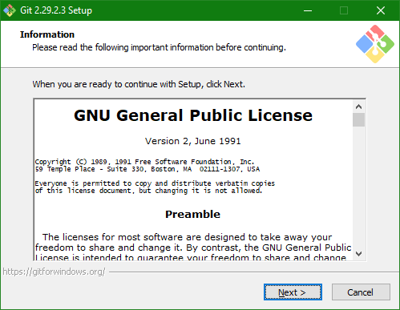  

Select the destination folder into which Git will be installed. Accepting the  
default is fine for this page.  

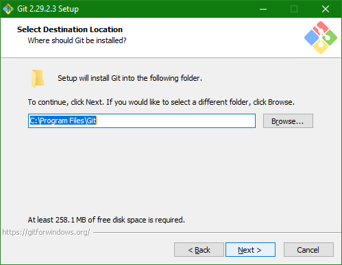  

Here, you select the additional features to be included with the install such  
as additional icons (git-gui, etc.).  
To save your eyes and make the occasional print task more uniform, select a  
true-type font.  
To keep Git updated on a regular basis, check the "Check daily for Windows  
updates" selection.  

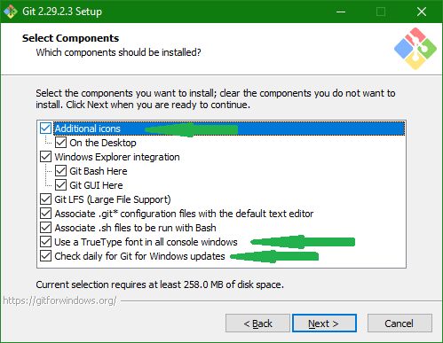  

Selecting the default here is fine, unless you don't want a Start Menu Folder  
to be created for Git. The author just selects the default.

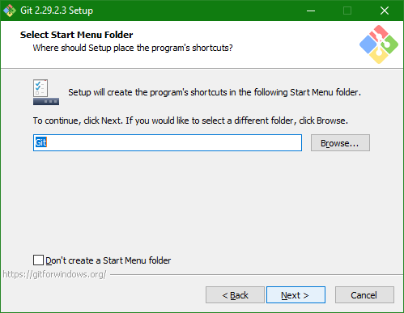  

Now, a biggie here. Selecting your editor of choice. This is why you should  
install Visual Studio Code **_FIRST_**, then install Git - so you can select  
Visual Studio Code as your editor come time to enter commit messages, etc.  
As can be seen, both Visual Studio Code-Insiders and Visual Studio Code  
are available as a choice. Git doesn't care which you use, the choice is up to  
you.

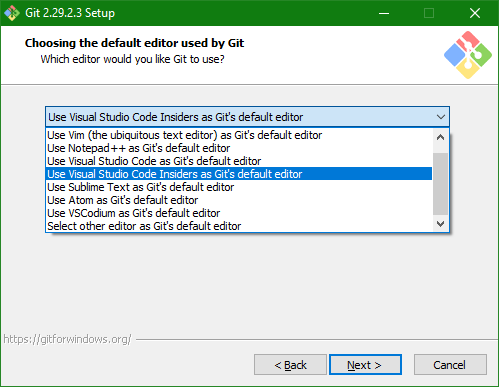  

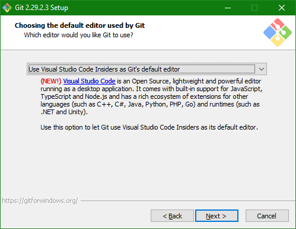  

This one is rather important. The _old_ standard of primary branch name used to  
be "master". Common convention has changed this to "main". This screen allows  
Git to automatically set up the desired primary branch name as "main" in keeping  
with the current naming standards. This should be the default, just leave it  
that way.  

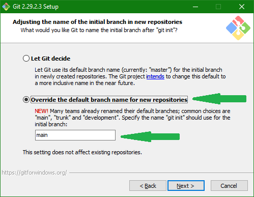  

Given that many utilities will call Git from the command line behind the scenes  
it behooves the user to allow such activity to take place so, select the "allow"  
function here.

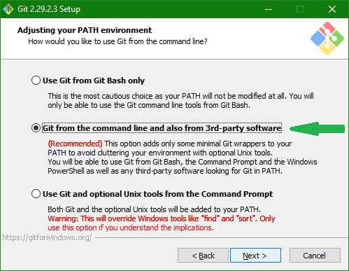  

Hmmm. Which security library to use? Since Windows 10 1803, the OpenSSL library  
has been installed by default and this is soon to be, if not already, the  
standard on Windows Server as well. This is the default, just accept it.  

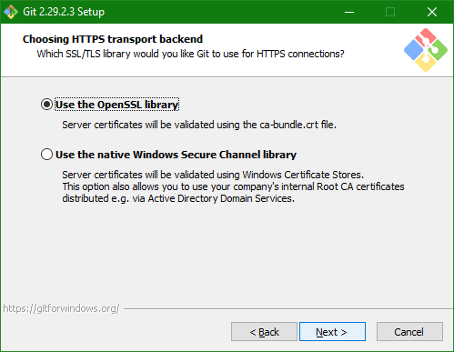  

Another biggie here. Line ending handling. As alluded to before, should the  
user be engaged in multi-platform development, non-Windows environments get  
"confused" by the standard Windows line ending choice of cr-lf (carriage return  
line feed). Most OS environments are content with just a lf as a line ending,  
this is certainly the case with Linux and since most Windows apps are no longer  
"confused" by just a lf line ending, choose the second option.  

  

With the release of Windows 10, most of the objections named are no longer an  
issue. One may use the Windows terminal without problem, especially if one is  
already windows-familiar. This is not a critical choice so if the user is  
already Linux-familiar, choose MinTTY if desired. The author is a Windows guy  
and stuck with what he knows.  

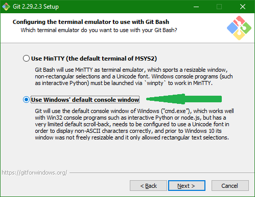  

Given that you don't want Git "helping" unless you tell it to, accept the  
default here and move on. No need to let Git "fiddle" with things nor force  
it's actions in a limited fashion.  

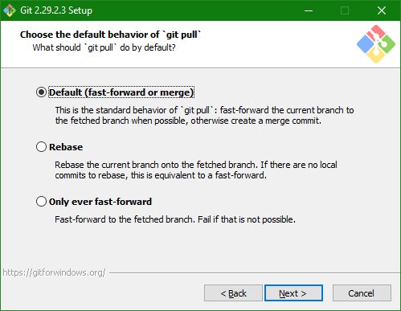  

Credential helper here - use the default. The old one is deprecated and "none"  
is just too painful to use when using multiple remote sites.  

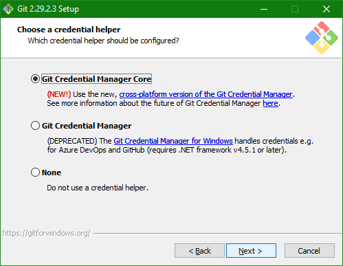  

Extra options here - take the file caching and, to help Linux do its thing,  
allow Symbolic links, which are 'way more powerful in Linux than Windows but  
that should be changing in the near future. If you're already a Linux person  
then there is no need to explain, you already get it. If not, just trust the  
author and take the symbolic links.  

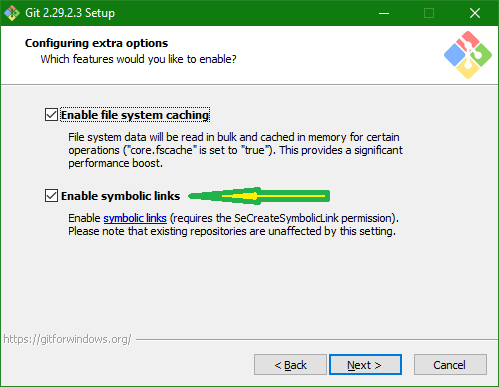  

This is production, the author recommends **_NOT_** using _anything_  
"experimental" when it comes to version control and storage of all things code.  

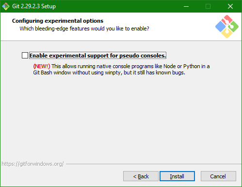  

That's it! Git is now installed and ready to use. From here, you might want to  
consider some customizations (aliases for commonly used commands, setting up  
Git to use Beyond Compare as its differencing and merging tool, etc.), all of  
which are described within this document.  
One last tidbit - if you don't want to wait for Git to figure out that it  
should update itself, you can execute the following command:

`git update-git-for-windows`  

to run the installer that will update Git.  

[Git-Url]: https://git-scm.com/downloads  
